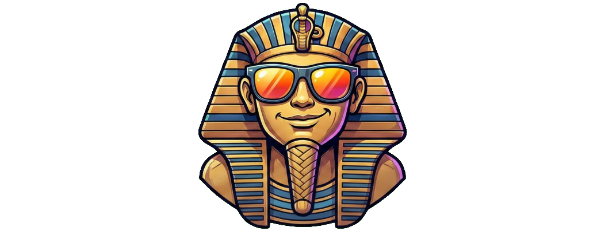

.. DEV-APP-UV-SPHINX documentation master file, created by
   sphinx-quickstart on Sat Jan  3 01:26:19 2026.
   You can adapt this file completely to your liking, but it should at least
   contain the root `toctree` directive.

Project documentation
===============================

Sommaire
--------

.. toctree::
   :maxdepth: 2
   :caption: Contents:

   self
   api
   models
   modules

.. include:: ../../README.md
   :parser: myst_parser.sphinx_